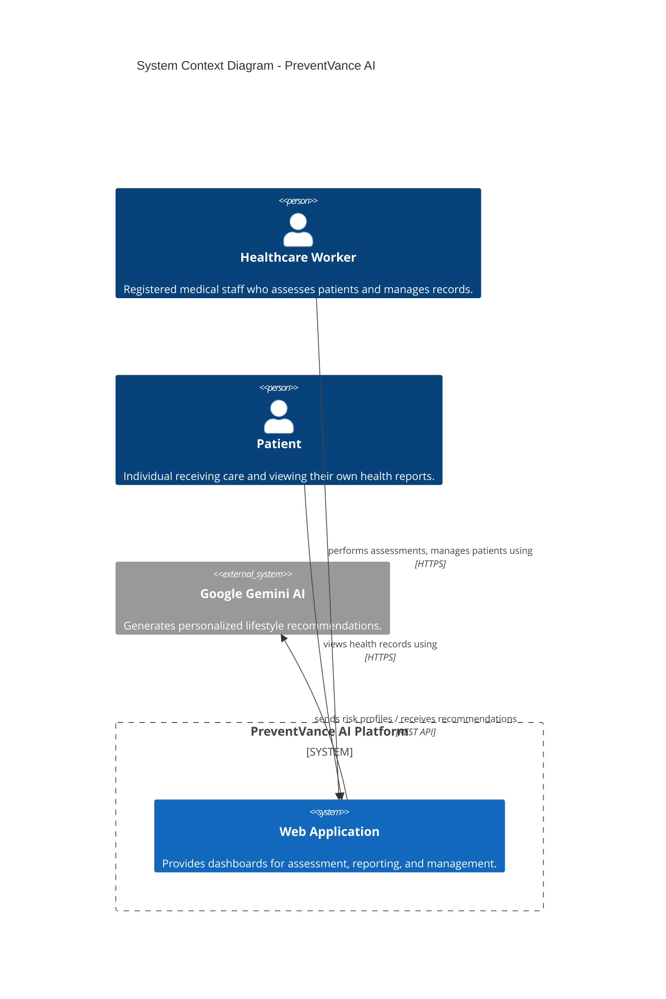
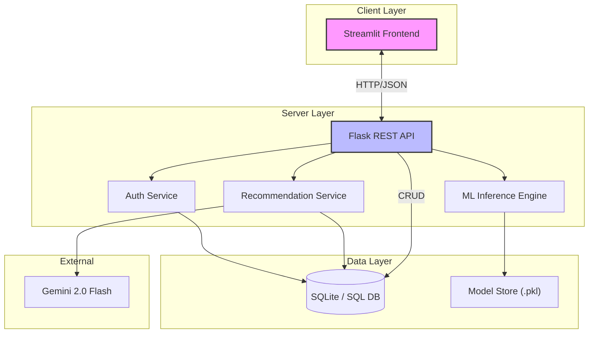
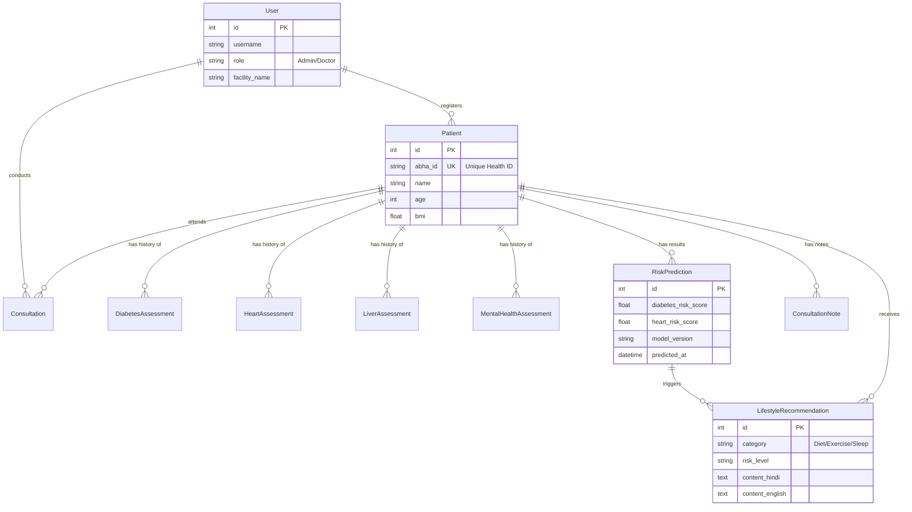
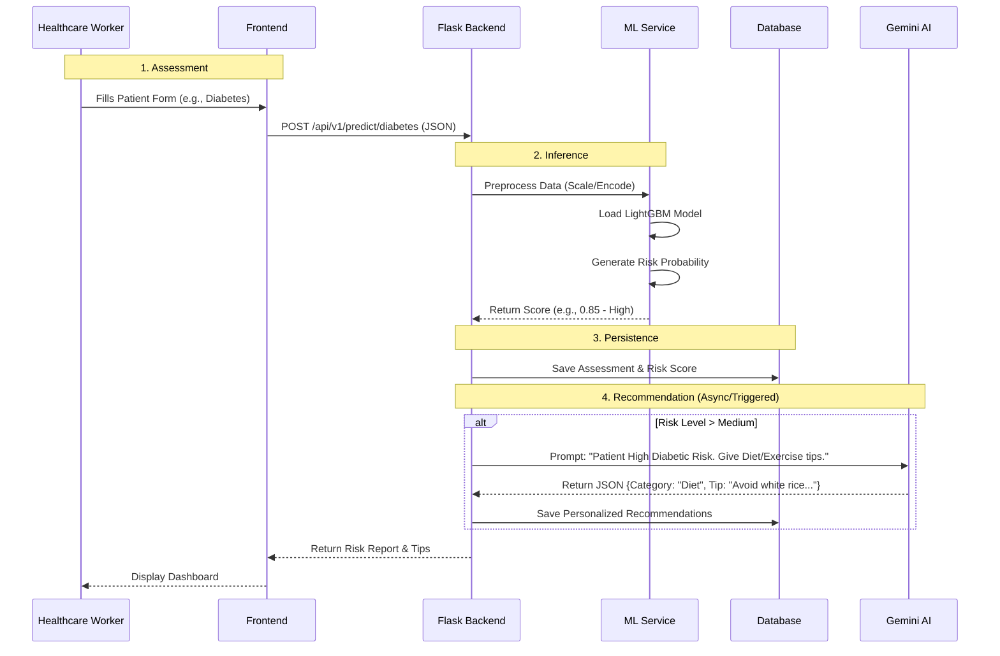

# PreventVance AI - System Architecture

> **Comprehensive Technical Design Document**
> *Version 2.0 | Last Updated: January 2026*

## 1. Executive Summary

**PreventVance AI** is a specialized healthcare analytics platform designed to empower healthcare workers in rural and resource-constrained environments. It enables the early detection of chronic diseases (Diabetes, Heart Disease, Liver Disease, Mental Health issues) using Machine Learning and provides personalized lifestyle recommendations via Generative AI.

The system is built on a decoupled **Client-Server architecture**, featuring a responsive **Streamlit** frontend for interactive dashboards and a robust **Flask** backend for API management, ML inference, and data persistence.

---

## 2. High-Level Architecture

### System Context Diagram (Level 0)
This diagram illustrates the interactions between the primary users and external systems.

### Container Architecture (Level 1)
The high-level technical components and their responsibilities.

---

## 3. Data Architecture (ER Diagram)

The database schema is designed using **SQLAlchemy ORM** and enforces strict referential integrity. It supports users, patients, disease-specific assessments, predictions, and recommendations.

---

## 4. Machine Learning & Recommendation Pipeline

The core intelligence of PreventVance AI involves a two-step process: **Predictive Analytics** (ML) followed by **Generative Guidance** (LLM).

### Operational Workflow

### ML Models
| Disease | Algorithm | Tuned Hyperparameters | Features |
| :--- | :--- | :--- | :--- |
| **Diabetes** | LightGBM (SMOTE) | `learning_rate`, `num_leaves` | Glucose, BP, BMI, Age, Insulin |
| **Heart** | SVM (Weighted) | `kernel='rbf'`, `C` | Cholesterol, BP, Smoking, Age |
| **Liver** | LightGBM | `max_depth` | Bilirubin, Enzymes (SGPT/SGOT), Protein |
| **Mental Health** | Logistic Regression | `solver='liblinear'` | PHQ-9, GAD-7 Scores |

---

## 5. Component Details

### Frontend (`medml-frontend/`)
*   **`app.py`**: Main entry point handling authentication routing.
*   **`api_client.py`**: Singleton service wrapper for all Backend API calls. Manages JWT tokens.
*   **`pages/`**:
    *   `1_Patient_Dashboard.py`: Read-only view for patients.
    *   `2_Admin_Dashboard.py`: Complex multi-tab interface for Registrations, Assessments, and Analytics.

### Backend (`medml-backend/`)
*   **`app/api/`**: Blueprints for distinct functional areas (`auth`, `patients`, `assessments`, `predict`).
*   **`app/services.py`**:
    *   **ML Loading**: Loads `.pkl` models into memory on startup.
    *   **Preprocessing**: Handles feature engineering (e.g., BMI calc, One-Hot Encoding) ensuring training-inference consistency.
    *   **Gemini Integration**: Manages prompts and JSON parsing for the LLM.
*   **`app/models.py`**: Defines the data schema.

## 6. Implementation & Deployment
*   **Tech Stack**: Python 3.9+, Flask 2.0+, Streamlit, SQLAlchemy.
*   **Environment**:
    *   Models are stored locally in `models_store/`.
    *   Environment variables manage secrets (`GEMINI_API_KEY`, `JWT_SECRET_KEY`).
*   **Scalability**: The stateless Flask API allows for horizontal scaling behind a load balancer (e.g., Nginx) if needed.
