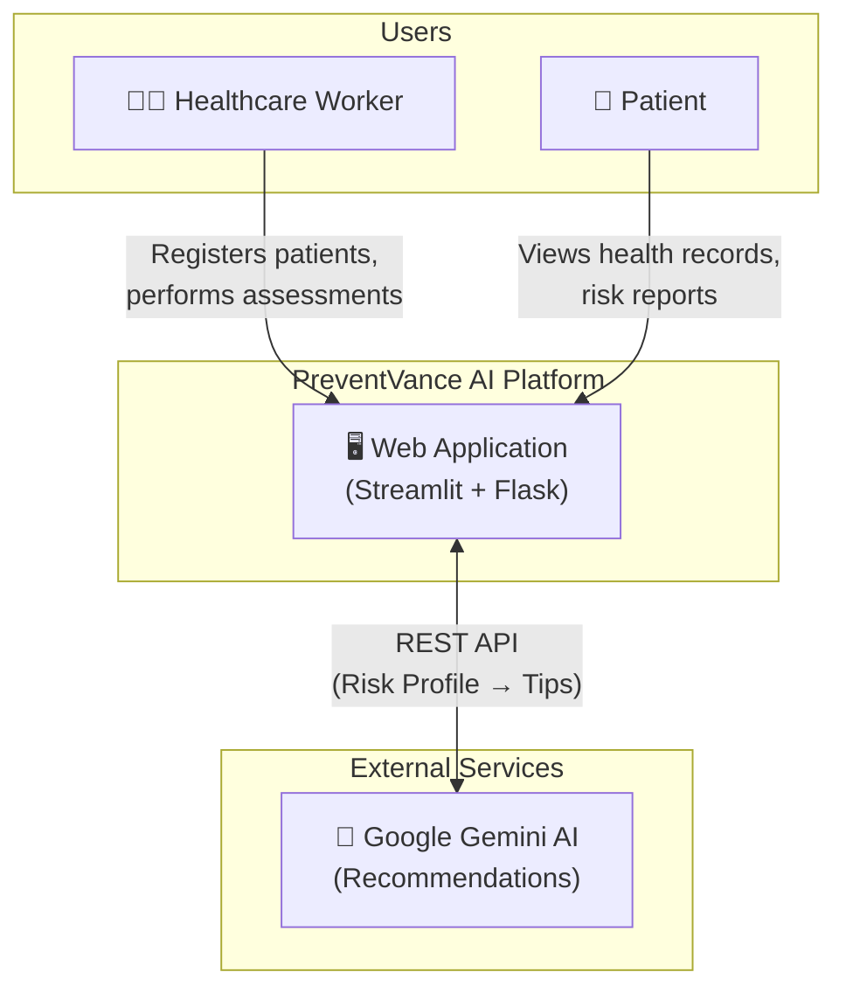
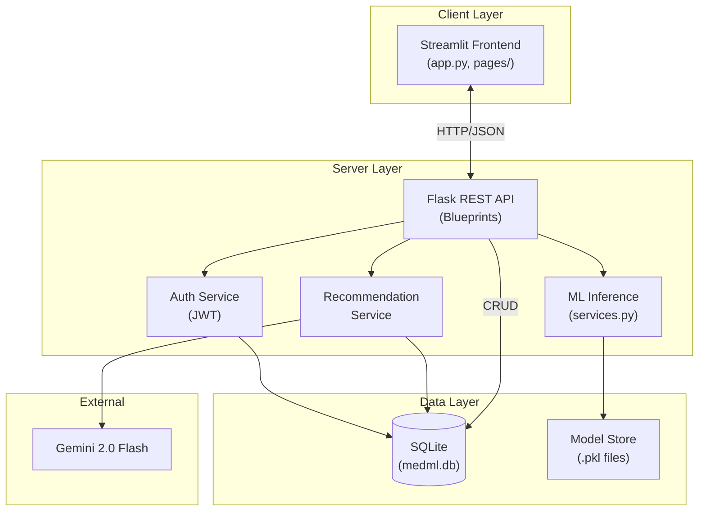
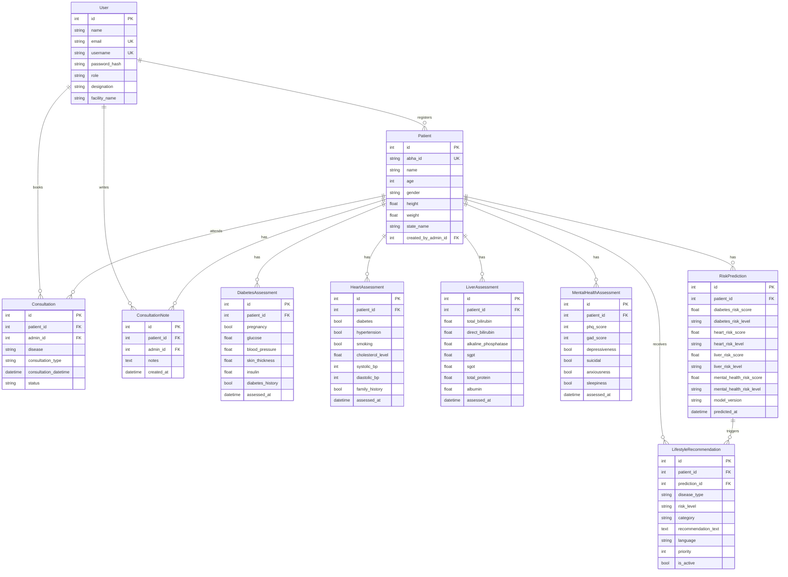
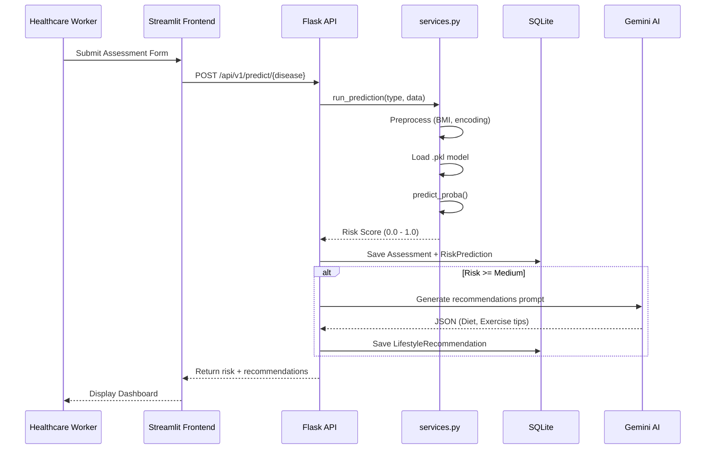

# PreventVance AI - System Architecture

> **Technical Design Document**
> *Version 2.0 | Last Updated: January 2026*

---

## 1. Executive Summary

**PreventVance AI** is a healthcare analytics platform designed for rural healthcare workers. It enables early detection of chronic diseases—**Diabetes, Heart Disease, Liver Disease, and Mental Health issues**—using Machine Learning, and provides personalized lifestyle recommendations via Google Gemini AI.

The system uses a decoupled **Client-Server architecture** with a **Streamlit** frontend and a **Flask** REST API backend.

---

## 2. High-Level Architecture

### System Context Diagram
This diagram shows the interactions between users, the system, and external services.

---

### Container Architecture
The high-level technical components and their responsibilities.

---

## 3. Database Schema (ER Diagram)

The database uses **SQLAlchemy ORM** with **SQLite**. Below is the entity-relationship diagram based on `models.py`.

---

## 4. ML & Recommendation Pipeline

### Sequence Diagram

---

### ML Models

| Disease | Model File | Algorithm |
|:--------|:-----------|:----------|
| **Diabetes** | `diabetes_LightGBM SMOTE.pkl` | LightGBM with SMOTE |
| **Heart** | `heart_SVM Weighted Tuned.pkl` | SVM (Weighted, Tuned) |
| **Liver** | `liver_LightGBM SMOTE.pkl` | LightGBM with SMOTE |
| **Mental Health** | `mental_health_depressiveness_Logistic Regression.pkl` | Logistic Regression |

---

## 5. Component Structure

### Frontend (`medml-frontend/`)

| File | Purpose |
|:-----|:--------|
| `app.py` | Main entry, login routing |
| `api_client.py` | HTTP wrapper for backend API, JWT management |
| `theme.py` | UI styling and theming |
| `pages/1_Patient_Dashboard.py` | Patient read-only view |
| `pages/2_Admin_Dashboard.py` | Admin multi-tab interface |

### Backend (`medml-backend/`)

| Directory/File | Purpose |
|:---------------|:--------|
| `app/api/auth.py` | JWT authentication (Admin/Patient login) |
| `app/api/patients.py` | Patient CRUD |
| `app/api/assessments.py` | Disease assessment endpoints |
| `app/api/predict.py` | ML prediction triggers |
| `app/api/recommendations.py` | Gemini recommendation retrieval |
| `app/api/reports.py` | PDF report generation |
| `app/services.py` | ML loading, preprocessing, Gemini integration |
| `app/models.py` | SQLAlchemy ORM models |
| `models_store/` | Pre-trained `.pkl` model files |

---

## 6. Deployment

- **Tech Stack**: Python 3.9+, Flask, Streamlit, SQLAlchemy, SQLite
- **ML Libraries**: Scikit-Learn, LightGBM, XGBoost, Joblib
- **Environment Variables**: `GEMINI_API_KEY`, `JWT_SECRET_KEY`
- **Local Run**: `start.bat` (Windows) or `start.sh` (Linux/Mac)
